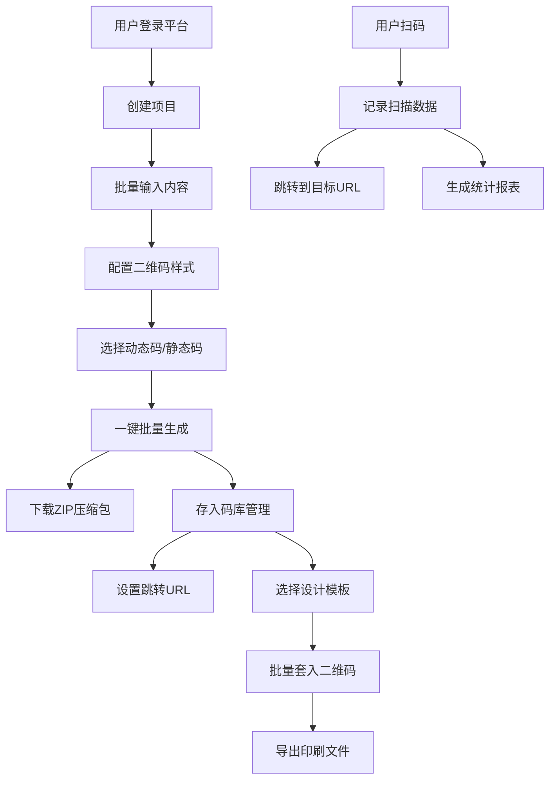

## 1. 产品概述

二维码批量生成与管理平台，为企业和个人用户提供一站式二维码创建、管理、追踪和印刷解决方案。用户可批量生成自定义样式的二维码，通过动态码技术实现链接跳转的随时更新，并通过扫描数据统计洞察用户行为，最终结合设计模板快速产出线下物料印刷文件。

## 2. 核心功能

### 2.1 用户角色

| 角色 | 注册方式 | 核心权限 |
|------|----------|----------|
| 管理员用户 | 邮箱/手机号注册 | 全部功能：创建项目、批量生成二维码、管理码库、查看统计、编辑模板、批量操作 |

### 2.2 功能模块

1. **仪表盘首页**：数据概览、快捷入口、最近活动
2. **批量生成页**：内容输入、样式配置、实时预览、批量导出
3. **码库管理**：二维码列表、搜索筛选、详情查看、批量操作
4. **项目管理**：项目创建、分类归档、项目概览
5. **扫描统计**：趋势图表、地域分布、设备分析、实时数据
6. **模板中心**：模板列表、在线编辑器、批量导出印刷文件
7. **动态码跳转**：短链服务、扫描记录、跳转配置

### 2.3 页面详情

| 页面名称 | 模块名称 | 功能描述 |
|-----------|-------------|---------------------|
| 仪表盘首页 | 数据概览卡片 | 总码数、今日扫描、活跃码数、累计扫描等关键指标 |
| 仪表盘首页 | 快捷操作区 | 快速生成、新建项目、模板中心入口 |
| 仪表盘首页 | 扫描趋势图 | 近7天/30天扫描量折线图 |
| 仪表盘首页 | 最近生成列表 | 展示最近创建的10个二维码 |
| 批量生成页 | 内容输入区 | 支持URL列表粘贴、CSV导入、结构化数据表单 |
| 批量生成页 | 样式配置面板 | 颜色（黑白/彩色）、Logo上传、形状（方形/圆形/圆角）、纠错级别 |
| 批量生成页 | 实时预览区 | 实时显示配置效果的二维码预览 |
| 批量生成页 | 项目选择 | 选择归属项目，设置有效期 |
| 批量生成页 | 导出下载 | 批量生成ZIP打包下载，支持PNG/SVG/PDF格式 |
| 码库管理 | 筛选搜索栏 | 按项目、状态、类型、日期筛选，关键词搜索 |
| 码库管理 | 二维码列表 | 缩略图、名称、类型、状态、扫描数、创建时间、操作按钮 |
| 码库管理 | 批量操作栏 | 批量禁用/启用、批量修改跳转URL、批量延期、批量删除 |
| 码库管理 | 二维码详情 | 扫码预览、编辑信息、跳转历史、扫描明细 |
| 项目管理 | 项目列表 | 项目卡片展示，显示码数、扫描量、状态 |
| 项目管理 | 项目详情 | 项目内码列表、项目统计、项目设置 |
| 扫描统计 | 总览面板 | 累计扫描、今日扫描、平均每日、峰值数据 |
| 扫描统计 | 趋势图表 | 按日/周/月的扫描趋势折线图、柱状图 |
| 扫描统计 | 地域分布 | 中国地图热力图、省份排名、城市排名 |
| 扫描统计 | 设备分析 | 操作系统占比、浏览器类型、设备类型饼图 |
| 模板中心 | 模板列表 | 卡片式展示各行业模板（餐厅、展会、名片、海报等） |
| 模板中心 | 模板编辑器 | 拖拽式编辑，嵌入二维码，文字图片编辑 |
| 模板中心 | 批量导出 | 选择二维码批量套入模板，导出PDF印刷文件 |

## 3. 核心流程

### 3.1 批量生成二维码流程
用户进入批量生成页 → 输入内容（URL列表/CSV） → 选择二维码样式 → 配置动态码选项 → 选择归属项目 → 实时预览效果 → 一键批量生成 → 打包下载ZIP

### 3.2 动态码使用流程
生成动态码 → 用户扫码 → 系统记录扫描数据（时间、IP、UA） → 跳转到当前配置的目标URL → 管理员后台可随时修改目标URL → 无需重新生成二维码

### 3.3 模板印刷流程
选择或编辑设计模板 → 将二维码嵌入模板指定位置 → 选择需要印刷的二维码列表 → 批量生成带码的设计文件 → 导出PDF/PNG供印刷使用

## 4. 用户界面设计

### 4.1 设计风格
- **主色调**：深蓝科技蓝 #1e3a8a，搭配青绿色渐变 #0ea5e9 → #14b8a6
- **辅助色**：琥珀橙 #f59e0b 作为强调按钮，珊瑚红 #ef4444 作为危险操作
- **中性色**：深灰 #1f2937，中灰 #6b7280，浅灰 #f3f4f6，纯白 #ffffff
- **按钮风格**：圆角 8px，悬停阴影，渐变背景主按钮
- **字体**：标题使用现代几何无衬线字体，正文使用清晰易读的系统字体族
- **布局风格**：左侧导航栏 + 顶部工具栏 + 主内容区的三段式布局，卡片式内容容器
- **图标风格**：线性 Lucide 图标，统一 20px 尺寸

### 4.2 页面设计概览

| 页面名称 | 模块名称 | UI元素 |
|-----------|-------------|-------------|
| 仪表盘首页 | 数据概览卡片 | 渐变背景卡片，数据大字显示，趋势小箭头，毛玻璃质感 |
| 仪表盘首页 | 扫描趋势图 | 平滑折线图，渐变填充区域，动画加载效果 |
| 批量生成页 | 样式配置面板 | 分组折叠面板，颜色选择器，Logo上传区，形状单选卡片 |
| 批量生成页 | 实时预览 | 居中展示二维码，可放大查看，背景棋盘格支持透明 |
| 码库管理 | 列表项 | 缩略图 + 信息 + 状态标签 + 操作按钮，悬停高亮 |
| 扫描统计 | 图表区域 | 多图表联动，时间范围选择器，数据导出按钮 |
| 模板中心 | 编辑器 | 左侧工具栏 + 中间画布 + 右侧属性面板，网格辅助线 |

### 4.3 响应式设计
- Desktop-first 设计，最小支持 1280px 宽度
- 平板端（768px-1280px）：左侧导航栏折叠为图标模式
- 移动端（<768px）：底部Tab导航，内容垂直堆叠，图表简化展示

### 4.4 动效设计
- 页面入场：卡片渐入上移动画，stagger 延迟
- 数据加载：骨架屏 + 脉冲动画
- 二维码生成：生成过程显示进度条，完成后轻微缩放弹出
- 悬停交互：按钮提升 2px + 阴影加深，卡片背景色微变
- 图表：数据曲线绘制动画，柱状图从底部增长
