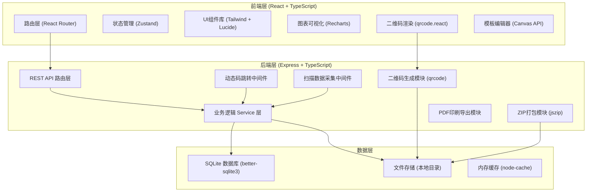
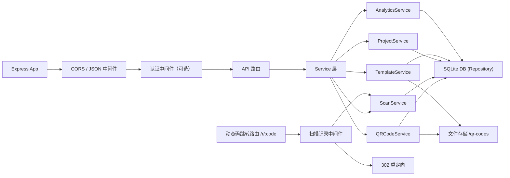
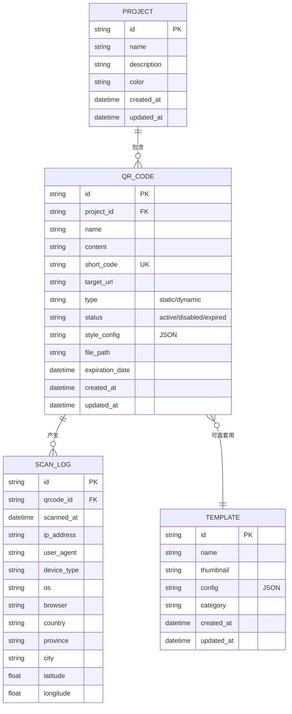

## 1. 架构设计



## 2. 技术描述

- **前端框架**：React@18 + TypeScript
- **构建工具**：Vite@5
- **样式方案**：Tailwind CSS@3
- **状态管理**：Zustand
- **路由管理**：react-router-dom@6
- **图标库**：lucide-react
- **二维码生成（前端预览）**：qrcode.react
- **图表可视化**：recharts
- **HTTP客户端**：axios
- **后端框架**：Express@4 + TypeScript
- **二维码生成（后端）**：qrcode
- **ZIP打包**：jszip
- **数据库**：better-sqlite3（嵌入式数据库，无需独立服务）
- **PDF生成**：pdf-lib
- **图像处理**：sharp
- **UUID生成**：uuid

## 3. 路由定义

| 前端路由 | 页面 | 功能 |
|-------|---------|------|
| / | 仪表盘首页 | 数据概览、快捷操作 |
| /generate | 批量生成 | 批量输入、样式配置、生成下载 |
| /qrcodes | 码库管理 | 二维码列表、筛选、批量操作 |
| /qrcodes/:id | 二维码详情 | 二维码信息、编辑、扫描明细 |
| /projects | 项目管理 | 项目列表、新建项目 |
| /projects/:id | 项目详情 | 项目内二维码、项目统计 |
| /analytics | 扫描统计 | 趋势、地域、设备分析 |
| /templates | 模板中心 | 模板列表、编辑器入口 |
| /templates/:id | 模板编辑器 | 在线编辑、批量导出 |

## 4. API 定义

### 4.1 二维码相关

```typescript
// 批量生成二维码
POST /api/qrcodes/batch-generate
Request: {
  contents: Array<{ url: string; name?: string }>;
  projectId?: string;
  style: {
    color: { foreground: string; background: string };
    logo?: string; // base64
    shape: 'square' | 'circle' | 'rounded';
    errorCorrectionLevel: 'L' | 'M' | 'Q' | 'H';
    size: number;
  };
  isDynamic: boolean;
  expirationDate?: string;
}
Response: {
  ids: string[];
  downloadUrl: string;
}

// 获取二维码列表
GET /api/qrcodes
Query: {
  projectId?: string;
  status?: 'active' | 'disabled' | 'expired';
  type?: 'static' | 'dynamic';
  keyword?: string;
  page: number;
  pageSize: number;
}
Response: {
  items: QRCode[];
  total: number;
}

// 获取单个二维码
GET /api/qrcodes/:id
Response: QRCode

// 更新二维码
PUT /api/qrcodes/:id
Body: {
  name?: string;
  targetUrl?: string;
  status?: 'active' | 'disabled';
  expirationDate?: string;
}

// 批量操作
POST /api/qrcodes/batch
Body: {
  ids: string[];
  action: 'disable' | 'enable' | 'delete' | 'updateUrl' | 'extend';
  payload?: any;
}

// 下载二维码ZIP
GET /api/qrcodes/download/:token
```

### 4.2 动态码跳转与扫描

```typescript
// 动态码跳转（短链接）
GET /r/:shortCode

// 扫描统计
GET /api/analytics/summary
Query: { qrcodeId?: string; projectId?: string; startDate?: string; endDate?: string }

// 扫描趋势
GET /api/analytics/trend
Query: { qrcodeId?: string; projectId?: string; period: 'day' | 'week' | 'month' }

// 地域分布
GET /api/analytics/geo
Query: { qrcodeId?: string; projectId?: string }

// 设备分布
GET /api/analytics/devices
Query: { qrcodeId?: string; projectId?: string }
```

### 4.3 项目管理

```typescript
// 项目列表
GET /api/projects
Response: Project[]

// 创建项目
POST /api/projects
Body: { name: string; description?: string; color?: string }

// 项目详情
GET /api/projects/:id
Response: Project & { qrcodeCount: number; totalScans: number }

// 更新/删除项目
PUT /api/projects/:id
DELETE /api/projects/:id
```

### 4.4 模板管理

```typescript
// 模板列表
GET /api/templates
Response: Template[]

// 创建/更新模板
POST /api/templates
PUT /api/templates/:id
Body: { name: string; thumbnail: string; config: JSON }

// 批量套模板导出
POST /api/templates/export
Body: { templateId: string; qrcodeIds: string[]; format: 'pdf' | 'png' }
```

## 5. 服务端架构



## 6. 数据模型

### 6.1 ER 图



### 6.2 DDL 语句

```sql
CREATE TABLE projects (
  id TEXT PRIMARY KEY,
  name TEXT NOT NULL,
  description TEXT DEFAULT '',
  color TEXT DEFAULT '#3b82f6',
  created_at DATETIME DEFAULT CURRENT_TIMESTAMP,
  updated_at DATETIME DEFAULT CURRENT_TIMESTAMP
);

CREATE TABLE qr_codes (
  id TEXT PRIMARY KEY,
  project_id TEXT REFERENCES projects(id),
  name TEXT DEFAULT '',
  content TEXT NOT NULL,
  short_code TEXT UNIQUE,
  target_url TEXT,
  type TEXT NOT NULL DEFAULT 'static',
  status TEXT NOT NULL DEFAULT 'active',
  style_config TEXT NOT NULL DEFAULT '{}',
  file_path TEXT,
  expiration_date DATETIME,
  created_at DATETIME DEFAULT CURRENT_TIMESTAMP,
  updated_at DATETIME DEFAULT CURRENT_TIMESTAMP
);

CREATE INDEX idx_qr_codes_project ON qr_codes(project_id);
CREATE INDEX idx_qr_codes_status ON qr_codes(status);
CREATE INDEX idx_qr_codes_short_code ON qr_codes(short_code);

CREATE TABLE scan_logs (
  id TEXT PRIMARY KEY,
  qrcode_id TEXT NOT NULL REFERENCES qr_codes(id),
  scanned_at DATETIME DEFAULT CURRENT_TIMESTAMP,
  ip_address TEXT,
  user_agent TEXT,
  device_type TEXT,
  os TEXT,
  browser TEXT,
  country TEXT,
  province TEXT,
  city TEXT,
  latitude REAL,
  longitude REAL
);

CREATE INDEX idx_scan_logs_qrcode ON scan_logs(qrcode_id);
CREATE INDEX idx_scan_logs_time ON scan_logs(scanned_at);

CREATE TABLE templates (
  id TEXT PRIMARY KEY,
  name TEXT NOT NULL,
  thumbnail TEXT,
  config TEXT NOT NULL DEFAULT '{}',
  category TEXT DEFAULT 'general',
  created_at DATETIME DEFAULT CURRENT_TIMESTAMP,
  updated_at DATETIME DEFAULT CURRENT_TIMESTAMP
);
```

## 7. 目录结构

```
project-root/
├── api/                    # 后端 Express 代码
│   ├── src/
│   │   ├── index.ts        # 入口文件
│   │   ├── routes/         # API 路由
│   │   ├── services/       # 业务逻辑
│   │   ├── repositories/   # 数据访问层
│   │   ├── middleware/     # 中间件
│   │   ├── db/             # 数据库连接与初始化
│   │   └── utils/          # 工具函数
│   └── tsconfig.json
├── src/                    # 前端 React 代码
│   ├── pages/              # 页面组件
│   ├── components/         # 通用组件
│   ├── hooks/              # 自定义 Hooks
│   ├── store/              # Zustand 状态
│   ├── api/                # API 调用封装
│   ├── utils/              # 工具函数
│   ├── types/              # TypeScript 类型定义
│   ├── App.tsx
│   ├── main.tsx
│   └── index.css
├── shared/                 # 前后端共享类型
├── data/                   # SQLite 数据库文件
├── qr-codes/               # 生成的二维码图片存储
├── .trae/documents/        # 项目文档
├── package.json
├── vite.config.ts
├── tailwind.config.js
└── tsconfig.json
```
